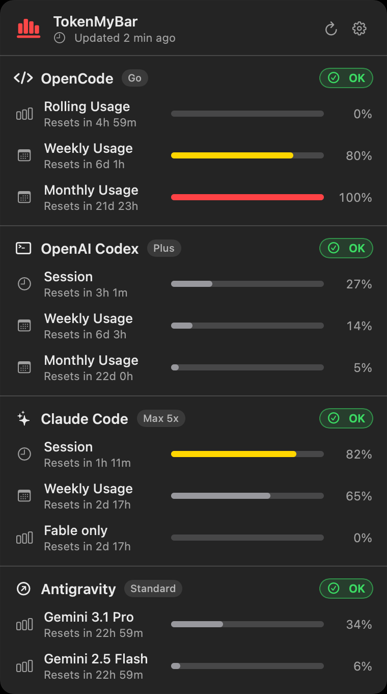

# TokenMyBar

TokenMyBar is a native macOS menu bar app that gives you real-time insight into token usage, reset windows, and plan limits across Claude Code, OpenAI Codex, OpenCode, and Google Antigravity. Built with a privacy-first approach, it runs with zero telemetry.



## What You See

- Native macOS popover with one material background, system icons, and system colors.
- Menu bar usage like `OpenCode icon 8% Codex icon 27% Claude icon 14% Antigravity icon 34%`.
- Vendor sections for OpenCode, Codex, Claude, and Antigravity with reset windows and usage meters.
- Antigravity adds one grouped "Gemini models" row — the same allowance its own quota screen shows; per-model rows appear only via the OAuth fallback, normally when the IDE is closed ([docs/antigravity.md](docs/antigravity.md)).
- Settings for display mode, enabled vendors, summary calculation, and menu bar behavior.

## Install

Requires macOS 14 (Sonoma) or newer on Apple Silicon.

Releases are ad-hoc signed, not notarized (no Apple Developer ID yet). Gatekeeper
only checks *quarantined* apps, so the paths below differ mainly in who clears the
quarantine flag.

- **Install script** (recommended — verifies checksum, no Gatekeeper prompt):

  ```bash
  curl -fsSL https://raw.githubusercontent.com/coodyapp/token-my-bar/main/install.sh | bash
  ```

- **Homebrew** — recent Homebrew refuses casks from untrusted third-party taps, so
  either `brew trust --tap coodyapp/tap` first or install with the check off:

  ```bash
  brew tap coodyapp/tap
  HOMEBREW_NO_REQUIRE_TAP_TRUST=1 brew install --cask token-my-bar
  ```

- **DMG**: grab `TokenMyBar-<version>.dmg` from the [latest release](https://github.com/coodyapp/token-my-bar/releases/latest), drag to `/Applications`, then `xattr -rd com.apple.quarantine /Applications/TokenMyBar.app`.

Full instructions (Gatekeeper notes, first-run Keychain prompts, uninstall): [docs/installation.md](docs/installation.md).

## User Guide

See [docs/user-guide.md](docs/user-guide.md) for setup, settings, display modes, and troubleshooting. Changes per release: [CHANGELOG.md](CHANGELOG.md).

## Packages

- `apps/menubar`: Swift macOS menu bar app, shared core, and Swift CLI.
- `apps/www`: React + Vite website.
- Swift CLI lives in `apps/menubar/Sources/TokenMyBarCLI`. It is build-from-source
  only — the DMG and Homebrew cask ship `TokenMyBar.app` alone.

## Development

```bash
swift build --package-path apps/menubar
swift test --package-path apps/menubar
pnpm install
pnpm build:www
```

Architecture, provider rules, and the release process live in [docs/development.md](docs/development.md).

## Privacy

TokenMyBar reads the vendor sessions already on your Mac: `~/.codex/auth.json`, the `Claude Code-credentials` Keychain item, `~/.gemini/oauth_creds.json` for Antigravity, and — for OpenCode — the `opencode.ai` cookie from a local browser cookie store. Nothing is written back, and the snapshot cache stores no OAuth tokens, cookies, authorization headers, API keys, or passwords. Details: [docs/privacy.md](docs/privacy.md).

## License

MIT — see [LICENSE](LICENSE).
